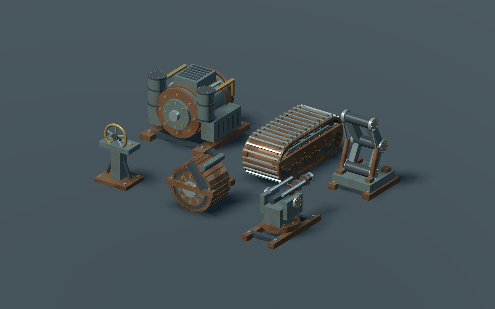

# Tractionism — construction and mechanics prototype

Open `project.godot` in Godot 4.7 and press **F6** with `scenes/main.tscn` open, or **F5** to run the project. Material textures are bundled; no extra downloads or addons are required.

## Controls

| Input | Action |
| --- | --- |
| WASD / mouse | Walk / look |
| Shift | Slow edge-safe walk (hold to avoid stepping off ledges) |
| Ctrl / Space | Sprint / jump |
| 1–9 / 0 / mouse wheel | Select a building piece (0 = helm) |
| Q | Cycle module size: 2 m / 1 m / 4 m |
| Alt (hold) | 0.125 m precision for every piece |
| G | Toggle placement grid (outside the custom editor) |
| Left mouse | Place green preview |
| Right mouse | Remove the piece under the crosshair |
| Mouse view | Automatically orient pieces in 90° steps |
| Middle mouse | Copy the piece under the crosshair |
| Z | Undo the last construction edit (up to 20) |
| T / P | Open material swatches / repeat paint with the active material |
| C | Open the custom-block creation inspector |
| E | Take/release an aimed helm, or edit a custom block |
| B | Toggle building |
| Escape | Release / capture mouse; leave helm when driving |
| F5 / F9 while playing | Save / load construction |

You spawn on bare terrain. Place a wheel, tread, or leg first (M opens the module menu), then select a foundation with 1 and aim at the running gear to snap onto its top mount. Extend the deck from foundation edges. Aim at a foundation and press E to board it. Wheels come in 2×2, 3×3, 4×4, 5×5 and 6×6 sizes; Q cycles wheel sizes, or choose one in M. Larger wheels cost more, weigh more, and require more power. Walls, doorways, railings, window walls and half walls snap to its edges. Turn your view to change orientation; stairs rise in the direction you face. A small angular buffer prevents jitter near diagonal headings. Place stairs on a foundation, then aim at their upper edge to attach a landing. Floors also attach above full walls, window walls, and support pillars. Railings and half walls do not support upper floors. Walls, doorways, and window walls also stack directly on other full-height walls: aim at the upper half of the supporting wall. The new wall inherits that edge and alignment. You can keep stacking within placement reach, and the top wall can support floors. Removing a load path flags disconnected sections red; disconnected machinery stops contributing power or traction. Keep the stairwell open so you can walk upstairs.

Green means placement is allowed; red previews explain why placement is blocked. Reach is 10 metres. Building spends scrap. Disconnected structural sections remain visible and collidable, but are flagged red and cannot run machinery. The original chassis foundation cannot be dismantled; inspect it to see CHASSIS CORE in the HUD. Z undoes construction and its resource cost, and can undo a load. Driving, firing, repair, and combat clear construction history so Z cannot rewind those actions. Undo only moves you upward if a restored piece would intersect you. F9 replaces the current construction with the last F5 save. Saves are stored in Godot's `user://construction.json`.

## New building pieces

6. **Railing:** waist-high posts and rails with physical collision.
7. **Window wall:** full-height structural wall with an open window.
8. **Half wall:** low cover and balcony edges.
9. **Pillar:** a structural column placed on a 0.25 m grid, supporting floors above.

Shift edge protection works while grounded, including diagonal approaches, and still allows walking along ledges. Releasing Shift permits stepping off. Jumping intentionally bypasses the edge guard; it does not catch an airborne player. Ctrl retains sprint. Existing version-1 saves remain compatible.

## Detailed building and snapping

All pieces now use the same **0.25 m grid**, with **0.125 m precision while holding Alt**. New foundations, floors and wall sections default to **2 m** modules. Press **Q** to cycle **2 m → 1 m → 4 m** for foundations, floors, walls, doorways, windows, railings and half walls. Storey height stays 3 m (half walls are 1.5 m). Stairs, pillars and helms retain their dimensions. Existing pieces keep their saved sizes; old saves without size data load as 4 m modules.

- **Every piece: 0.25 m grid.** Hold **Alt** for 0.125 m adjustments.
- **G** toggles a local grid overlay. The HUD shows the active increment, module width and city-local coordinates.
- Aim near a deck edge to align a wall flush with that perimeter, or attach a new foundation flush to the old one. Edge alignment can use half-module offsets to keep differently sized pieces flush.
- Place interior partitions anywhere their full length is supported. Pillars and helms can sit off-centre wherever their entire base fits.
- Supports can span seams between adjacent floor/foundation tiles, but a missing tile or unsupported overhang blocks placement. Overlapping deck tiles and collinear wall segments are rejected; shared seams and perpendicular wall joints are allowed.
- Stack compact wall sections along wider wall tops, including half-wall tops. Full-height walls, pillars and stair landings can support upper floors.
- Middle-click copies both the material and module size of a structural piece. Custom blocks remain nonstructural.

The grid, modules and support checks all use city coordinates, so detailed builds remain aligned after driving and turning. Shift still guards edges; it is not repurposed for structural fine placement.

## Driving the city

1. Press **0** to select **Helm**, then place it anywhere its base fits on a foundation or floor. Its front follows your view when placing it.
2. Stand on the city within **3 m**, aim at the helm, and press **E**.
3. **W/S** drive forward/reverse; **A/D** turn left/right. The active helm's facing direction defines forward, independently of where you look.
4. **Space** brakes. Releasing W/S slows the city to a stop. **E or Esc** releases the helm and immediately stops the city so you can walk/build again.

Before driving, press **M** and place wheels, treads, or legs on the ground, build foundations on their top mounts, and install an engine on the deck. A medium engine and four wheel assemblies are a useful starting layout. Machinery must connect through structural pieces to the chassis. **X** toggles the aimed module's connection to the shared power bus.

Speed, acceleration and turning derive from total structural/module/custom-block/cargo mass, powered traction, remaining component health, and terrain drag. Engines burn fuel; overloading the common bus reduces movement and locks guns out below 65% power. Wheel, tread, and leg assemblies have different speed, torque, and terrain coefficients. Hills slow movement and the chassis follows terrain height. Exact compound collision shapes stop a city against other cities; a finite 720 m landscape bounds this prototype. There is no block-count or city-size limit in the model or save format.

Movement is **kinematic**, using Jolt compound collision and swept obstacle checks. It is not articulated suspension, wheel friction, a ragdoll, or simulated walking-leg joints. Cities remain level while their root follows the highest sampled ground beneath the hull. Traction uses shared performance math, not forces applied to individual wheels.

Building coordinates and snapping stay city-local after turns. Saves retain the pose and load stopped. Multiple helms are allowed; the one you use defines forward. A helm without working traction and engine power cannot drive.

## Mechanics loop (steps 1–7)

This is a **local two-city prototype**, not a networked multiplayer implementation. **F6 while playing** creates one test rival; **F7** switches between the two crews. The rival has no AI and stays still until you control it. Both use the same components, power, health, gun, tow, and loss code. No teams or fixed predator/prey roles exist.

| Input | Action |
| --- | --- |
| M | Build catalogue: Structural / Decoration / Engineering side tabs |
| X | Switch the aimed owned module on/off on the shared `main` bus |
| H | Repair an aimed owned structural component using scrap |
| F | Fire your powered deck gun at the crosshair (tap for each shot) |
| R | Aim at a disabled rival to tow; press again to release |
| J (hold) | Reel the target toward the gut processor |
| F6 / F7 | Spawn test rival / switch local crew |
| F8 | Save this player's independent blueprint |
| F10 | After defeat/capture, reconstruct that blueprint if affordable |

1. Build an engine, traction, helm, gun and gut processor. Put the gun at an unobstructed front edge; shots start at its barrel, so your own walls can block them. Place the gut at an accessible perimeter, with its open mouth facing the target. Modules show footprint, cost and power in M.
2. Drive to the rival. Tap F while aiming at a visible wheel or engine. Each hit resolves a specific shape inside its chunk and damages that component. Damaged components darken; wrecks become black and remain collidable. Inspect nearby parts to see HP and connectivity.
3. Disable mobility to **30% or less**, approach within **22 m** of the attachment point, then press R. Towing adds the target's mass to your load and makes you take **35% extra incoming gun damage**. The target's crew can still use a powered gun while towed—switch with F7 to verify.
4. Hold J to feed the target into an operational gut. Processing requires actual contact and power, consumes real blocks over time, and yields scrap and fuel. The rope attaches to surviving surfaces as blocks are consumed. The chassis is processed last. Moving out of contact or losing processor power pauses processing.
5. Destroying the chassis or finishing capture marks defeat. A pre-damage blueprint is protected automatically. The owner retains **50%** of their current scrap and fuel, once per defeat. F10 rebuilds at a clear location only if sufficient scrap is available; it restores healthy components and saved power switches, then deducts the full cost. F8 can explicitly replace the saved design.

Player blueprints live under `user://player_blueprints/<owner-hash>.json`, separate from F5 live saves. They contain relative block/module positions, materials, sizes, chassis identity, custom blocks and each module's route to the `main` bus plus its switch state. They do not preserve damage as part of the design. Files are validated before loading and written via a temporary file then rename. Retained wallet and defeat status persist with the player blueprint and are loaded on restart. Local player IDs are prototype identities, not authenticated accounts.

No harpoons, towns, mining, offline simulation, servers, leaderboards or team/invite systems have been added.

## Materials and custom blocks

**T** opens all four material swatches at once: Steel, Wood, Concrete, and Brick. Click one or press **1–4**. If you were aiming at a building piece, this immediately paints it and selects that material for future pieces. Otherwise it only changes the active material. **Esc** cancels; **P** repeats the current paint on another piece. Painting is undoable with Z. Swatches use preloaded materials, so switching requires no download or loading step.

Press **C** to create a custom block or aim at one and press **E** to edit it:

- **Move [G]:** drag the colored X/Y/Z handles to reposition the block.
- **Resize [F]:** drag the square handles to change a local dimension. The opposite face stays anchored; height grows upward from the base.
- Dragging snaps to **0.25 m**, or **0.05 m while holding Shift**.
- **Right-drag** in the world to orbit the preview. Closing the editor restores your first-person viewpoint.
- **Wall / Floor / Beam / Cube** presets create useful proportions immediately.
- **Click surface:** then click a world surface to reposition the preview there.
- **Material swatches** update the preview immediately, without a dropdown or cycling. The preview shows the actual texture; red indicates invalid placement.
- **R** rotates 90°. **Duplicate** creates an editable copy beside the existing block.
- **Exact position / dimensions** expands optional numeric controls for precise edits. The panel scrolls when expanded.
- **Enter / Place / Apply** confirms; **Esc / Cancel** discards. **Delete** removes an existing custom block. Confirmed edits are undoable with **Z**.

Position is the bottom-centre in city coordinates; move handles turn with the city. Dimensions are local to the block and range from 0.1–24 m. The tool remembers your last confirmed dimensions and material for subsequent blocks. The whole block must remain inside the finite landscape and its origin within 24 m of you. You cannot commit a block through the player. Custom shapes may overlap other geometry for detail work. The original collision remains active until you apply an edit.

Textures are bundled 1K PBR maps from ambientCG under CC0; see [credits and license](assets/materials/LICENSE.md). Mesh-local mapping keeps texture density consistent during resizing and moves the texture with the city.

Custom blocks are solid and walkable but **never provide structural support or snapping sockets**. You cannot place structural pieces from them or through them. They remain independent when structural supports are removed. They are not automatically destroyed by structural pruning.

**F5/F9** save and restore both building systems, transforms, and materials. **Z** undoes placing, editing, painting, deleting, or loading, including custom blocks. Version-1 saves load with default materials; version-2 saves retain their materials; new saves use version 5 and include pose, widths, component HP, power switches, fuel, scrap, and defeat status. Invalid saves leave the current world intact.

## Code

- `scripts/city_controller.gd`: power-derived helm motion, terrain following, pilot carrying, swept collision and finite map bounds.
- `scripts/player.gd`: capsule collision, mouse look, gravity, jumping and movement.
- `scripts/piece.gd`: procedural meshes and collision; stairs use an invisible ramp for smooth traversal.
- `scripts/world.gd`: sandbox, HUD, construction sockets, support graph and persistence.
- `scripts/material_library.gd`: shared textured material cache.
- `scripts/custom_block.gd`: nonstructural block geometry; its chunk collision stays on physics layer 4.
- `scripts/custom_block_tool.gd`: direct editing, presets, orbit, precision inspector and validation.
- `scripts/block_gizmo.gd`: projected move/resize handles and drag snapping.
- `scripts/material_palette.gd`: direct material selection and painting.
- `scripts/build_rules.gd`: per-piece grid increments, footprint coverage and occupancy rules.
- `scripts/placement_grid.gd`: lightweight local grid overlay.
- `scripts/build_state.gd`: validation of saved construction before restoration.
- `scenes/main.tscn`: project entry scene.

Pieces use a shared 0.25 m placement grid (0.125 m with Alt), variable 1/2/4 m module widths, and a 3 m storey height. One designated chassis foundation roots each city’s connectivity graph. Walls and doorways require a floor, foundation, or aligned full-height wall beneath them. Stairs require a floor or foundation; upper floors require a full-height wall, pillar, or stair landing. Placement retains socket and player-overlap checks; the incremental chassis graph additionally controls machinery connectivity after edits and damage. Resource gathering, network transport, working doors, and finished environment art remain outside this prototype.

## Verification

Run the integration checks with your Godot executable:

```sh
godot --headless --path . --script tests/construction_test.gd
godot --headless --path . --script tests/building_qol_test.gd
godot --headless --path . --script tests/custom_building_test.gd
godot --headless --path . --script tests/editor_workflow_test.gd
godot --headless --path . --script tests/city_movement_test.gd
godot --headless --path . --script tests/city_input_test.gd
godot --headless --path . --script tests/fine_building_test.gd
```

The integration tests check supports, occupied sockets, physical stair traversal, save/load, cascading removal, automatic orientation, selection wrapping, undo, edge guarding in straight and diagonal motion, railing collision, wall stacking, custom-block isolation and collision, inspector commit/cancel/overlap rejection, move/scale undo, PBR loading, version-1/2/3/4 persistence, helm-facing movement, player carrying, braking, exit, boundaries, construction-undo isolation from driving, construction after arbitrary turns, fine-grid placement, support across mixed tile seams, compact doorway traversal, and mixed-width save/load and undo. The separate `godot --path . --script tests/editor_pointer_test.gd` test needs a graphical display and verifies actual pointer-driven movement, resizing and material selection; it also writes preview screenshots to `/private/tmp`. Tests use temporary saves under `/private/tmp` on macOS and remove them after success.

### Landscape and painting

The surrounding landscape is a generated 3D mesh with walkable collision and slope-based ground shading. A central starting clearing stays level; powered cities can drive over surrounding hills and through ancient city tracks, up to the finite terrain edge.

Press **V** to toggle the paint brush. Hold **left mouse** and sweep over structural pieces or custom blocks; one **Z** undo restores the entire stroke. **Right mouse** samples the material under the crosshair, **mouse wheel** cycles finishes, and **T** opens larger material swatches. In brush mode the palette only selects a finish. Outside brush mode, T retains its quick paint behavior and **P** paints the aimed piece once. Painting currently applies to whole pieces.

Steel, timber, concrete, and brick use individually tuned PBR texture scale, tint, roughness and surface normals. Existing material IDs and saved builds remain compatible. Pillars and helms can overlap walls/windows at deck boundaries while keeping their centre supported; aiming higher on a wall no longer sends them to the next storey.

## Architecture and tuning

- `scripts/mechanics/city_chunk.gd` / `chunk_index.gd`: 8 m city-local buckets, one compound AnimatableBody3D per occupied structural bucket and separate decoration buckets. Shape owners map hits back to the exact block. Updates rebuild only the changed member's shape owners.
- `structure_graph.gd`: spatial hash of actual block volumes, face/overlap contacts, chassis-rooted connectivity. Adds propagate only into newly supported islands. Removal traverses only components adjacent to the cut; severing a large bridge can require traversing a large component. No structural flood fill runs per physics tick. Disconnected sections are flagged rather than detached dynamic bodies. Importing a save can rebuild the graph once.
- `balance.gd`: shared mass, power, mobility, terrain drag and cost calculations, module tier data, damage and loss tuning.
- `city_systems.gd`: per-city health, fuel, scrap, switches, chunks and graph. Custom blocks add mass and collision but never carry structural load or power.
- `combat.gd`: gun cooldown, power gate, muzzle ray, per-component hit routing and tracer.
- `salvage.gd`: tow eligibility, reel/drag constraint, contact processing and single-consumption salvage.
- `blueprints.gd`: player-owned design validation, persistence, loss retention, resource checks and reconstruction.

**All balance numbers are provisional guesses.** Start tuning in `scripts/mechanics/balance.gd`: engine output/fuel/mass/HP/footprint/cost, traction draw/speed/torque/terrain/HP, gun damage (90), interval (0.6 s), power gate (65%), tow eligibility (30%), mass penalty (1.4×), vulnerability (1.35×), gut rate (28 cost units/s), salvage fraction (60%), and loss retention (50%). The same file also exposes prototype economy constants: 3,000 starting scrap / 400 fuel, 0.001 t per scrap / 0.01 t per fuel, repairs at half replacement cost scaled to damage, 0.02 fuel per processed cost unit, and 2 m/s reeling. Geometry-contact tolerances and chunk sizes are engineering parameters rather than balance stats.

The power bus is shared automatically through chassis-connected structure. There is no cable-routing editor; the saved route is the single `main` bus plus per-module switches. Physics ticks still aggregate the city's module/weight records; connectivity itself is incremental. Large-city performance and networking need dedicated work before multiplayer release.

Run every headless test (including the complete gun → disable → tow → gut → retention → rebuild loop):

```sh
python3 tests/run_headless.py /path/to/godot
```

The graphical pointer test remains separate. The full loop test uses real gun physics rays and temporary player profiles, checks defending fire while towed, insufficient-resource rejection, exact rebuild cost, persistence, and restoration of powered mobility. Movement tests also cover chassis-facing steering, pilot carrying, city-to-city collision, reversing out of contact, and ordinary hills.

## Mechanical art direction

Machinery now uses layered industrial forms based on the supplied reference: bolted drum engines, exposed manifolds, ribbed covers, linked tread shoes, wheel hubs/spokes, hydraulic leg braces, a geared gun mount, crusher rollers, and a brass-rimmed instrument helm. Running gear has ground-level origins and raised top mounts, with collision geometry matching the new undercarriage layout. Engine tiers retain their respective sizes.

Steel machinery uses a separate worn-metal shader with muted painted housings, oxidized frames, bright working surfaces and brass fasteners. Wear uses object-local coordinates, so it follows the city. Painting changes the primary body panels while retaining metallic mechanical hardware. Placement ghosts still show a consistent validity tint, and damage overlays apply to the detailed models.

Detail is merged into at most five material meshes per module. Hidden original meshes remain as support/mass proxies; rendering detail is excluded from structural volume and blueprint cost calculations. This is a procedural art pass, not imported production meshes or animated joints.



`tests/mechanical_art_test.gd` checks finish batching, body-only painting, ghost tinting and unchanged module cost. The mechanics loop and persistence tests also cover compatibility with this art pass.

Live saves use layout version 6. Older wheel-equipped saves and stored blueprints lift the superstructure above the running gear when loaded. Foundations without running gear retain their legacy height.

### Stretch foundations and build catalogue

Select a foundation with **1**, aim at running gear or an existing foundation edge, then **hold left mouse and move your view** to stretch a single rectangular slab. Release to place; **right mouse or Esc cancels**. A click without dragging places the starting size. The original supported footprint stays inside the stretched slab, and the preview shows dimensions and total scrap cost. Both axes resize on the shared fine grid. Support, overlap, player clearance, construction reach, and available scrap still apply. One undo removes the whole slab; saves and blueprints preserve both dimensions. Q changes the next starting size between 2, 1 and 4 metres.

**M** opens the catalogue with side tabs: **Structural** (foundations, floors, walls, stairs, railings, windows and pillars), **Decoration** (helm and the custom block tool), and **Engineering** (engines, all five wheel sizes, treads, legs, guns and gut processors). Click a piece to return to building. The helm remains functional even though it is grouped under Decoration.

### Drag structural pieces

Walls, doorways, window walls, half-walls and railings now use the same **hold LMB → look to stretch → release to build** interaction. They extend along their local length axis, preserving their baseline, facing and standard height. Long window walls repeat window bays; long railings repeat support posts. Floors stretch into rectangles like foundations. **RMB / Esc cancels**; **Alt** retains 0.125 m precision. Support, obstruction, scrap, undo and save checks apply to the entire resulting piece.

### Scrubland and ancient city tracks

The playable 720 m landscape now has green rolling terrain, deterministic instanced grass and brush, and two paired migration corridors. Each corridor follows a fixed straight axis through the map and continues visually into the distant landscape. Both sides of each corridor share a smoothly varying longitudinal cutting height, sampled below the lower surrounding terrain. Track beds stay level across their width and between the paired tracks; excavation gets deeper on uphill banks instead of tilting the old city. Physical transverse tread ridges repeat every 12 m, with bare soil, eroded banks and scattered rocks. Foliage avoids the worn beds. Ground height queries interpolate the same triangles used for collision, including negative elevations, so placement and city movement agree with the rendered terrain. The central starting clearing remains level. Foliage and small bank rocks are decorative; the terrain itself is collidable. The distant continuation is scenery beyond the existing playable boundary.
